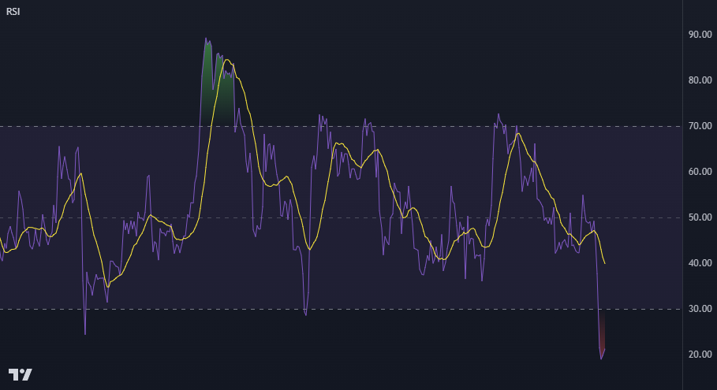

## TradingView's Demo Pine Script Code

* This is a practice session to get acquainted with uploading pine script code on github.
* The indicator below is a built-in indicator on Tradingview

## **_Relative Strength Index Indicator (RSI)_**

> The Relative Strength Index (RSI) is a well versed momentum based oscillator which is used to measure the speed (velocity) as well as the change (magnitude) of directional price movements. Essentially the RSI, when graphed, provides a visual mean to monitor both the current, as well as historical, strength and weakness of a particular market. The strength or weakness is based on closing prices over the duration of a specified trading period creating a reliable metric of price and momentum changes. Given the popularity of cash settled instruments (stock indexes) and leveraged financial products (the entire field of derivatives); RSI has proven to be a viable indicator of price movements.
